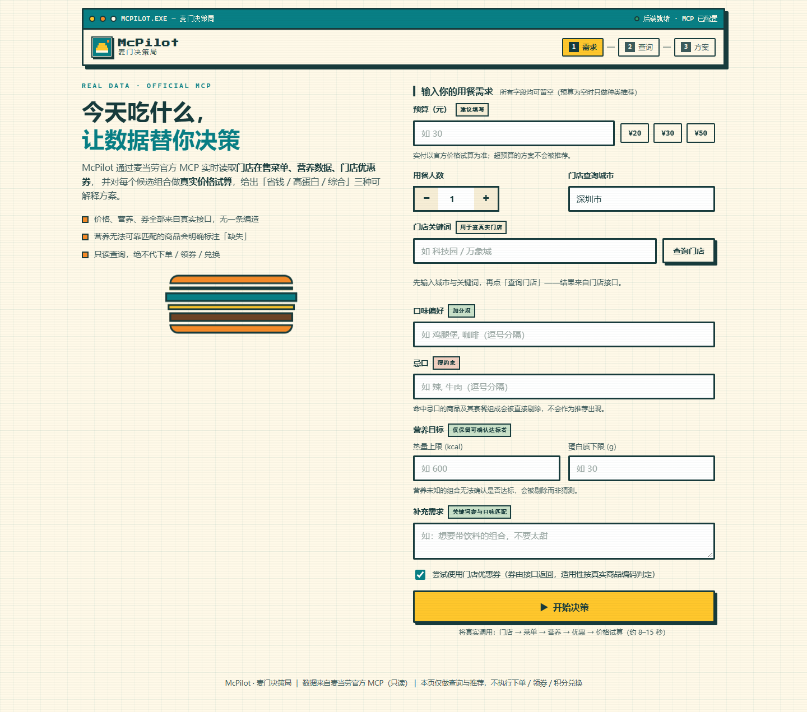
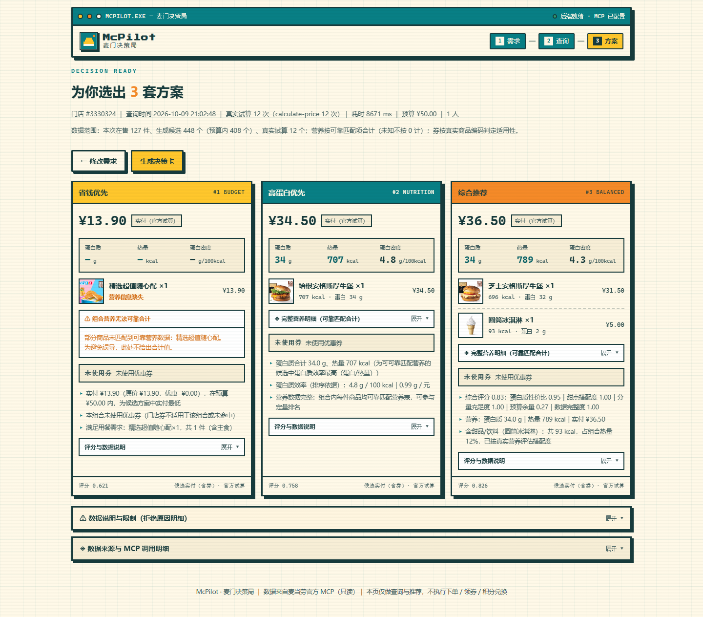
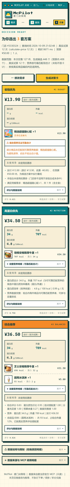

# McPilot · 麦门决策局

> 一个**真正调用麦当劳官方 MCP** 的 AI Skill：根据用户的**预算、营养需求、口味偏好**与**可用优惠券**，推荐最合适的麦当劳餐品组合。
>
> 🏆 参赛项目：**2026 麦当劳 1024 程序员创意开发大赛**

| 首页 | 推荐结果（桌面） |
|---|---|
|  |  |

*移动端（390px 无溢出）：* 

> 截图为 2026-10-09 **真实运行**结果（门店 #3330324，¥50 预算，真实 MCP 数据），非设计稿。
> 更多真实演示案例与推荐理由见 [`docs/11-demo-cases.md`](docs/11-demo-cases.md)。

**目标用户**：预算有限的学生 / 上班族、控热量或增蛋白的健康饮食人群、
想用优惠券省钱的"麦门"用户，以及需要"帮我搭配一份麦当劳"式决策的任何人。

---

## 一、项目目标

在"今天吃什么、怎么点最划算"这个高频又琐碎的决策上，给用户一个**可信、透明、可复现**的答案。

- **可信**：价格、营养、优惠券、门店全部来自麦当劳官方 MCP，**绝不编造**。
- **透明**：每一条推荐都给出选它的理由（预算、热量、优惠力度）。
- **安全**：只做"看和算"，当前阶段**不产生任何写操作**（不下单、不领券、不抽奖、不兑积分）。

## 二、核心功能

| # | 功能 | 说明 | 依赖 MCP 工具 |
|---|------|------|---------------|
| 1 | **门店查询** | 按城市/关键词找可点餐门店，支持到店自取与得来速 | `query-nearby-stores` |
| 2 | **菜单查询** | 拉取门店在售餐品与套餐组成 | `query-meals` / `query-meal-detail` |
| 3 | **营养匹配** | 分层匹配（精确/归一化/别名/规范全名/套餐组成），未命中如实标注"营养缺失" | `list-nutrition-foods` / `query-meal-detail` |
| 4 | **优惠券查询** | 查指定门店 + 订单类型下的可用优惠券 | `query-store-coupons` |
| 5 | **价格试算** | 对候选组合计算含优惠的总价（返回分为单位） | `calculate-price` |
| 6 | **组合推荐** | 受限枚举生成多商品搭配，三种策略择优出餐（含理由与数据缺失提示） | 组合调用上述工具 |

### 三种推荐策略

1. **省钱型（Budget）**：在满足餐品/口味/人数要求的前提下，追求**真实实付最低**。
2. **高蛋白型（Nutrition）**：预算内**蛋白质最高**；**只有营养数据可靠匹配的组合**才进入定量排名，
   营养未知的商品既不猜测、也不当 0。
3. **综合型（Balanced）**：对**蛋白质性价比 / 分量 / 口味 / 预算余量 / 数据完整度**做**可解释的加权评分**
   （不使用任何主观"饱腹感"指标）。

> 三者共享硬约束：门店真实在售、真实实付 ≤ 预算、营养目标达标、忌口过滤、份数 ≥ 人数。
> 详细规则见 [`docs/01-requirements.md`](docs/01-requirements.md) 与 Skill 内的 `references/recommendation-strategies.md`。

## 三、技术方案

```
用户自然语言
   │
   ▼
┌──────────────────────────────┐
│  Skill 层（WorkBuddy）        │  SKILL.md：理解意图、编排调用顺序、生成推荐话术
└──────────────┬───────────────┘
               ▼
┌──────────────────────────────┐
│  编排 / 服务层（src/mcpilot） │  营养匹配、优惠券匹配、价格试算、三种策略打分
└──────────────┬───────────────┘
               ▼
┌──────────────────────────────┐
│  MCP 层（麦当劳官方，只读）    │  6 个已核验工具
└──────────────────────────────┘
```

- **语言**：Python 3.13（核心零第三方依赖，便于评审复现）。
- **测试**：pytest（离线单元 210 条 + 真实集成 21 条）。
- **Skill 形态**：WorkBuddy Skill，源文件位于 `.workbuddy/skills/mcpilot-meal-recommender/`；
  WorkBuddy **只扫描用户级目录 `~/.workbuddy/skills/`**，使用时需按第六节第 8 步复制安装到该目录即可自动触发。
- **Web 形态**：`src/mcpilot/web/`，**Python 标准库 `http.server` + 原生 HTML/CSS/JS**，零构建、零第三方依赖（见第八节）。
- **接入方式**：通过 WorkBuddy 连接器调用麦当劳 MCP，鉴权由平台托管，**仓库不含任何凭据**。

> **两个交付物，同一套核心规则**：WorkBuddy Skill（`.workbuddy/skills/…`）与 Web 界面（`src/mcpilot/web/`）
> 是**两个不同入口**，但都调用 `src/mcpilot` 里**同一份**推荐逻辑（`recommender.recommend`），
> 因此规则一致、互不冒充。

## 四、目录结构

```
McPilot-麦门决策局/
├── README.md                 # 本文件
├── LICENSE                   # MIT
├── .gitignore                # 忽略凭据与运行时数据
├── .env.example              # 环境变量示例（值为空，无凭据）
├── docs/                     # 项目文档
│   ├── 01-requirements.md    # 功能需求文档
│   ├── 02-architecture.md    # 技术方案 / 架构（含两种接入方式）
│   ├── 03-mcp-tools.md       # MCP 工具清单、调用顺序与真实响应格式
│   ├── 04-roadmap.md         # 后续开发计划
│   ├── 05-phase1-report.md   # Phase 1 开发报告
│   ├── 06-phase2-report.md   # Phase 2 开发报告
│   ├── 07-phase3-report.md   # Phase 3 开发报告
│   ├── 08-phase4-report.md   # Phase 4 开发报告（Web 界面）
│   ├── 09-phase42-report.md  # Phase 4.2 开发报告（智能调整建议）
│   └── 10-phase43-report.md  # Phase 4.3 开发报告（推荐质量与产品说明）
├── .workbuddy/skills/
│   └── mcpilot-meal-recommender/   # ★ Skill 源文件（使用时复制到 ~/.workbuddy/skills/）
│       ├── SKILL.md                # Skill 定义（官方必填字段齐全）
│       ├── references/             # 按需加载的参考文档
│       └── assets/                 # 示例请求等静态资源
├── src/mcpilot/              # 核心库
│   ├── config.py             # 运行时解析 MCP 接入点（凭据零落盘）
│   ├── mcp_client.py         # 只读客户端（直连 + 白名单守卫 + 参数规则 + 有界重试）
│   ├── menu.py               # 菜单 / 详情解析（元）
│   ├── nutrition.py          # 营养分层匹配（精确/归一化/别名/规范全名/组成）+ 覆盖率报告
│   ├── resolve.py            # 按需解析规范全名与套餐组成（有界调用）
│   ├── coupon.py             # 券解析、时效判定与适用性匹配
│   ├── pricing.py            # 价格试算解析（分→元）
│   ├── combos.py             # 候选组合生成、去重与约束
│   ├── recommender.py        # 三种推荐策略 + 打分 + 结构化输出 + 进度回调 + CLI
│   ├── stores.py             # 门店查询解析（Phase 4）
│   ├── pipeline.py           # 端到端最小链路 + CLI
│   └── web/                  # ★ Web 界面后端（Phase 4）
│       ├── app.py            # HTTP 服务 + /api/* + SSE 真实进度
│       ├── jobs.py           # 后台任务与线程安全进度事件
│       └── static/           # 前端（index.html / styles.css / app.js）
├── scripts/
│   ├── phase3_report.py      # Phase 3 验收脚本（覆盖率/券/三档预算耗时）
│   └── run_web.py            # Phase 4 Web 启动脚本
├── tests/                    # 测试
│   ├── unit/                 # 离线单元测试（含 Web API 测试）
│   ├── integration/          # 真实 MCP 集成测试（含真实 Web 端到端）
│   └── fixtures/             # 真实采集夹具（券已脱敏；含明确标注的合成券）
├── examples/                 # 示例输入与一次真实推荐输出（不含凭据）
└── pytest.ini
```

## 五、已核验的 MCP 工具

| 工具 | 作用 | 读写 |
|------|------|------|
| `query-nearby-stores` | 查询可点餐门店 | 只读 |
| `query-meals` | 查询门店餐品/套餐列表 | 只读 |
| `query-meal-detail` | 查询餐品详情与可特调项 | 只读 |
| `list-nutrition-foods` | 获取营养数据 | 只读 |
| `query-store-coupons` | 查询门店可用优惠券 | 只读 |
| `calculate-price` | 价格试算（含优惠） | 只读 |

> 明确的**禁用清单**（当前阶段）：`create-order`、`auto-bind-coupons`、`draw-lottery`、`mall-create-order`、`party-order-create`、`cancel-order`、积分兑换等一切写操作。

## 六、快速开始

数据链路（Phase 1）、推荐算法（Phase 2）与营养/券/健壮性优化（Phase 3）均已可用。麦当劳 MCP 由 WorkBuddy 连接器提供
（或经环境变量配置），**仓库中不含任何凭据**。

```bash
# 1) 克隆仓库
git clone <your-repo-url> McPilot
cd McPilot

# 2) （可选）配置本地环境变量；.env 已被忽略
cp .env.example .env

# 3) 最小链路（真实 MCP）：门店 -> 菜单 -> 营养 -> 券 -> 价格
PYTHONPATH=src python -m mcpilot.pipeline --store 3330324 --be-type 1 --items 1100:1,4810:1

# 4) 三种策略推荐（真实试算）
PYTHONPATH=src python -m mcpilot.recommender --store 3330324 --be-type 1 --budget 30
PYTHONPATH=src python -m mcpilot.recommender --store 3330324 --be-type 1 --budget 40 --people 2 --dislike 辣
PYTHONPATH=src python -m mcpilot.recommender --store 3330324 --be-type 1 --budget 30 --json  # 结构化输出

# 5) 运行测试
python -m pytest tests/unit                       # 离线单元测试（233 条）
MCPILOT_LIVE=1 python -m pytest tests/integration  # 真实 MCP 集成测试（21 条）

# 5.1) 安全扫描（发布前自检；仓库中不含真实凭据）
python scripts/security_scan.py --strict

# 6) Phase 3 验收：营养覆盖率 / 券验证 / 三档预算耗时（真实 MCP）
PYTHONPATH=src python scripts/phase3_report.py --store 3330324 --be-type 1

# 7) 启动 Web 界面（真实 MCP 后端）—— 见第十节
python scripts/run_web.py            # 打开 http://127.0.0.1:8765/

# 8) 在 WorkBuddy 中使用本 Skill（自动触发）
#    平台只扫描【用户级】技能目录 ~/.workbuddy/skills/，不扫描仓库内的项目级 .workbuddy/skills/。
#    因此需先复制安装（保留仓库内原件不动）：
cp -r .workbuddy/skills/mcpilot-meal-recommender ~/.workbuddy/skills/
#    之后新建对话即可自动触发（无需依赖本项目的开发上下文），例如直接说：
#      "帮我搭配一份 30 元以内的麦当劳，要高蛋白"（可带门店/营养/口味/券等条件）
#    说明：SKILL.md frontmatter 已含官方必填字段 version / author / description(_zh/_en)。
```

> **三种使用方式**：① **WorkBuddy Skill**（复制安装到 `~/.workbuddy/skills/` 后可在**新会话自动触发**，
> 模型读取 SKILL.md 编排 `mcp__mcd-mcp__*` 工具）；② **Python 直连 MCP**（`McpClient()`，CLI/Web 共用）；
> ③ **Web 界面**（本仓库自带后端，真实调用同一逻辑）。
> 三者调用同一真实端点、共用同一服务层。详见 [`MCP_INTEGRATION.md`](MCP_INTEGRATION.md) 与
> [`docs/02-architecture.md`](docs/02-architecture.md) 第 9 节。

## 七、安全与合规

- 仓库、日志、示例文件中**绝不出现** MCP Token、`Authorization` 请求头、个人账号信息。
- 当前阶段**只调用只读工具**，不触发任何交易或资产变更。
- 所有价格/营养/优惠券**一律来自 MCP 实时返回**，不写死、不编造。
- 已配置 `.gitignore` 拦截 `.env`、日志与 WorkBuddy 运行时数据，可直接公开上传 GitHub。
- 提供自动化自检：`python scripts/security_scan.py --strict`（扫描真实凭据 / 手机号 / 身份证等）。
- **MCP Token 需自行申请**：见 [`MCP_INTEGRATION.md`](MCP_INTEGRATION.md) 第 6 节
  （登录 mcp.mcd.cn → 控制台 → 激活）。仓库中只有占位符示例
  [`mcp-config.example.json`](mcp-config.example.json)，不含任何真实凭据。

## 七点五、参赛文件

| 文件 | 说明 |
|---|---|
| [`README.md`](README.md) | 本文件（项目介绍 / 安装 / 使用示例 / 目标用户） |
| [`CONTEST_DECLARATION.md`](CONTEST_DECLARATION.md) | 参赛声明（与官方文件逐字节一致，未修改） |
| [`MCP_INTEGRATION.md`](MCP_INTEGRATION.md) | 实际使用的 MCP Server / Tool / 调用流程 / 业务价值 |
| [`mcp-config.example.json`](mcp-config.example.json) | 脱敏 MCP 配置示例（仅环境变量占位符） |
| `.workbuddy/skills/mcpilot-meal-recommender/` | 项目 Skill（SKILL.md + 引用文件） |
| [`docs/11-demo-cases.md`](docs/11-demo-cases.md) | 三种策略的真实演示案例 |

## 八、Web 界面（Phase 4）

一个**复古像素游戏 × 现代产品交互**风格的响应式网页，通过本地后端**真实调用**同一套推荐逻辑。

### 8.1 技术选型与理由

| 选项 | 决策 | 理由 |
|------|------|------|
| 后端 | **Python 标准库 `http.server`（`ThreadingHTTPServer`）** | 复用 `src/mcpilot` 的 Python 推荐逻辑，无需跨语言桥接；与服务端"零第三方依赖"原则一致，克隆即跑 |
| 进度推送 | **SSE（`text/event-stream`）+ 轮询兜底** | 推荐需 ~10s，用服务端真实回调驱动进度；SSE 断线时自动降级为轮询 |
| 前端 | **原生 HTML/CSS/JS** | 无 Node、无打包器；`python scripts/run_web.py` 一条命令即可运行 |
| 图片 | **官方 `query-meals.image`** | 严禁用无关图片冒充餐品；无图时显示占位符而非假图 |

> 未选用 React/Vue/Flask：能为评审降低运行门槛（不需要 npm install / 构建步骤），
> 且本项目 UI 复杂度不至于必须上框架。

### 8.2 启动（Windows 说明）

```powershell
# 在项目根目录执行（PowerShell 或 CMD 均可）
python scripts/run_web.py

# 自定义端口 / 打印访问日志
python scripts/run_web.py --port 9000 --verbose

# 等价写法（需先设置 PYTHONPATH=src；PowerShell 用 $env:PYTHONPATH="src"）
python -m mcpilot.web
```

启动后终端会打印 `本地预览： http://127.0.0.1:8765/`，用浏览器打开即可。
默认**只绑定 127.0.0.1**（仅本机可访问），停止按 `Ctrl+C`。

MCP 凭据复用与命令行相同的运行时解析（`mcpilot.config.resolve_endpoint`，来自
`~/.workbuddy/mcp.json` 或环境变量），**不会进入浏览器、前端代码或仓库**。

### 8.3 界面功能

1. **首页**：品牌标识与简介；预算（含 ¥20/¥30/¥50 快捷键）、人数、口味偏好、忌口、
   营养目标、补充需求；**真实门店选择**（城市 + 关键词 → 门店接口）。
2. **查询状态页**：门店 → 菜单 → 营养 → 券 → 解析 → 候选 → 试算 → 完成，
   每一步由**后端真实回调事件**驱动（非前端假进度）；支持中断、超时提示与重试。
3. **推荐结果页**：三种策略并排；真实餐品名/数量/官方图片/真实试算价；
   可靠营养合计或**明确标注"营养缺失"**；券是否适用及优惠金额；推荐理由；
   方案不足三个时**如实说明，不编造补齐**。
   每张卡片以**实付价为主视觉**，附 3 格关键指标（蛋白质 / 热量 / 蛋白质密度），
   营养明细与评分说明**默认折叠**；顶部展示**数据范围说明**（试算时间与覆盖范围）。
4. **可分享决策卡**：像素风卡片，可切换方案并**导出 PNG**，含门店、查询时间与数据说明。

> **高蛋白策略说明**（Phase 4.3）：默认以**蛋白质密度（g/100kcal）**为主排序，
> 兼顾总量与预算利用率；只有当用户**明确要求**最大化绝对蛋白质（说"蛋白最多"等
> 或把蛋白下限设到 ≥30g）时，才切换为**总量优先**。两种口径都**只使用营养可靠匹配**的组合，
> 未知营养不按 0 计。
>
> **甜品/饮料不会被人为禁止**：是否加入由真实营养数据（热量占比）、用户偏好与评分规则共同决定，
> 并在推荐理由里给出**可解释说明**。若"省钱优先"只推荐到一件主食，会明确标注为
> **经济单品方案**，不会宣称是营养完整的一餐。

### 8.4 接口一览

| 路径 | 方法 | 说明 |
|------|------|------|
| `/api/health` | GET | 健康检查（不触发 MCP） |
| `/api/config` | GET | 是否具备 MCP 凭据（**不含凭据本身**） |
| `/api/stores` | GET | 真实门店查询（`query-nearby-stores`） |
| `/api/recommend` | POST | 创建推荐任务 → `job_id` |
| `/api/jobs/<id>` | GET | 任务快照（轮询兜底） |
| `/api/jobs/<id>/events` | GET | SSE 真实进度事件流 |

### 8.5 仍为**只读**

Web 层不新增任何 MCP 能力：写操作在 `McpClient.call_tool` 的白名单守卫处即被拒绝，
因此网页**无法**下单 / 领券 / 抽奖 / 兑积分。

## 九、后续开发计划

| 阶段 | 目标 | 状态 |
|------|------|------|
| Phase 0 | 项目基建：目录、文档、Skill 初始文件、测试计划 | ✅ |
| Phase 1 | MCP 数据链路：6 个只读工具真实接入 + 解析/匹配 + 价格试算 | ✅ |
| Phase 2 | 实现三种推荐策略与打分；端到端给出组合推荐 | ✅ |
| Phase 3 | 营养匹配优化、券验证、推荐质量、健壮性与真实测试 | ✅ |
| Phase 4 | 响应式 Web 界面（像素风）+ 真实后端 + 决策卡 | ✅ |
| Phase 4.2 | 无结果时的结构化调整建议（一键带回表单，不自动放宽） | ✅ |
| Phase 4.3 | 推荐结果质量：高蛋白双口径、甜品可解释、经济单品诚实标注、结果页信息层级 | ✅ |

详见 [`docs/04-roadmap.md`](docs/04-roadmap.md)、[`docs/05-phase1-report.md`](docs/05-phase1-report.md)、
[`docs/06-phase2-report.md`](docs/06-phase2-report.md)、[`docs/07-phase3-report.md`](docs/07-phase3-report.md)
与 [`docs/08-phase4-report.md`](docs/08-phase4-report.md)、[`docs/09-phase42-report.md`](docs/09-phase42-report.md)、
[`docs/10-phase43-report.md`](docs/10-phase43-report.md)。

## 十、许可证

[MIT](LICENSE)
